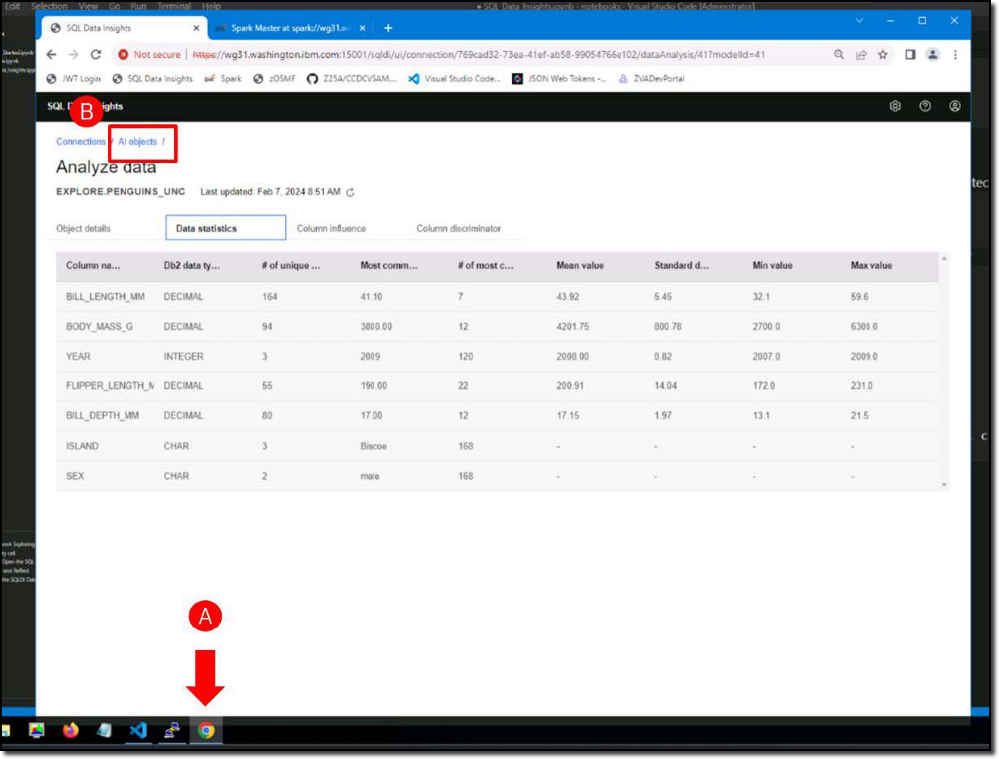
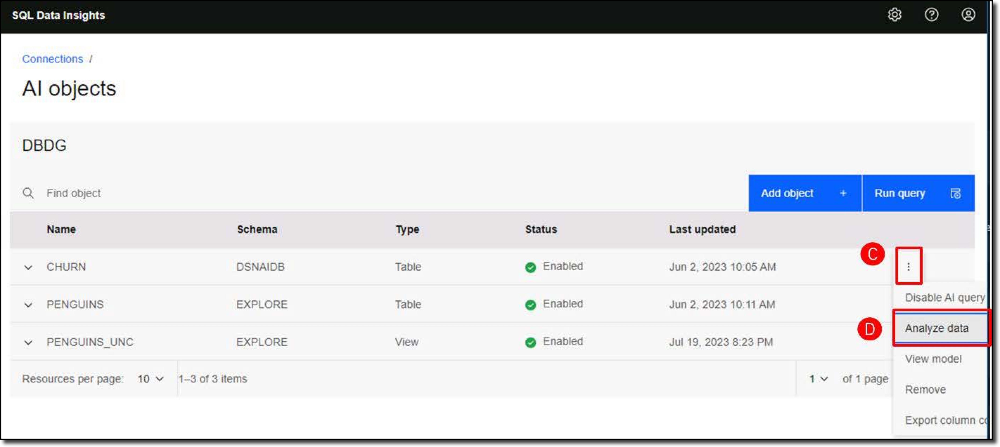
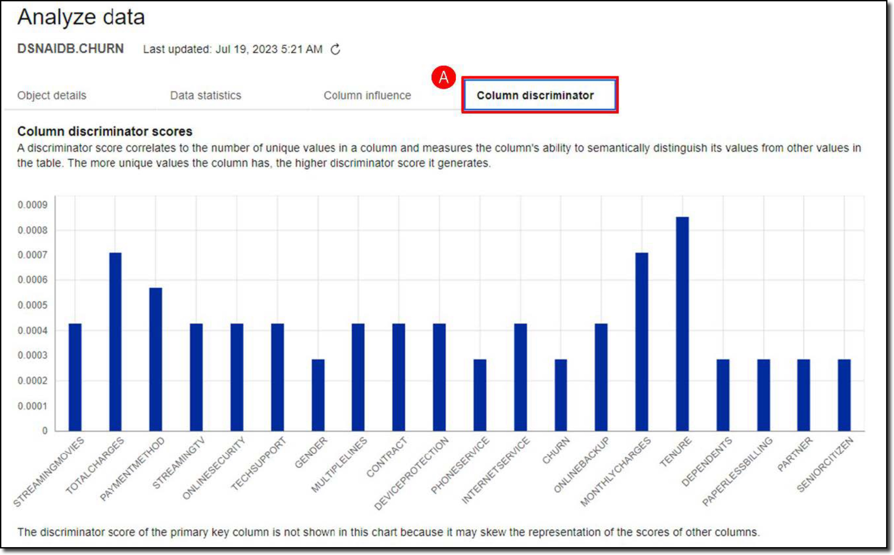
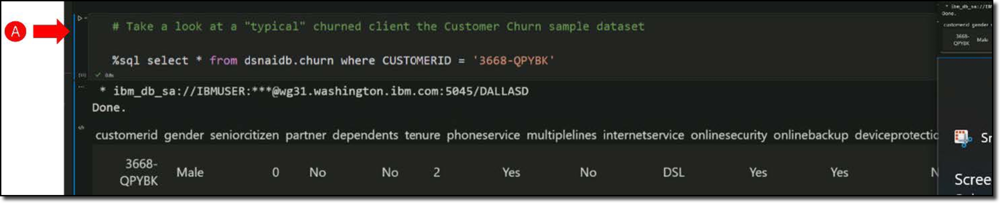

The Database Administrator has already trained the SQL Data Insights model for the **DSNAIDB.CHURN** table. Now, as the Business Analyst, use SQL Data Insights to analyze the data.

- Return to SQL Data Insights in the **Chrome browser** **(A)** and click the **AI objects** link **(B)**. 
  
    

- Click the **ellipses** () next to the **CHURN** table **(C)** and click **Analyze data**.

    

Review the **Analyze Data** reports for the **DSNAIDB.CHURN** table.

- Click on the **Column discriminator** tab (A).

    

The **column discriminator** report is very helpful in identifying the features in the **CHURN** dataset that are most significant in determining *similarity* or *dissimilarity* between records.

Pay particular attention to the **Column discriminator scores** for each of the columns in the SQL Data Insights model. *The chart shows the relative importance of each column in semantically distinguishing a customer record from other records.* It shows that the following four columns are the most influential:

- **TOTALCHARGES**

- **PAYMENTMETHOD**

- **MONTHLYCHARGES**

- **TENURE**

**Customer 3668-QPYBK** has churned. If there are reasons to believe that this customer is representative of the pattern of account cancellations, then you can find the most similar customers based on the *similarity score* from SQL Data Insights.

- Return to the Jupyter Notebook in VS Code.
- Run the **SQL query** to find **Customer 3668-QPYBK** **(A)**.

    

With SQL Data Insights it is easy to find out which customers that have not yet churned are most similar to the customer (or cluster of customers) who have churned.

- Run the **SQL query** to find customers similar to **Customer 3668-QPYBK** **(A)** based upon the most influential columns mentioned earlier (TOTALCHARGES, PAYMENTMETHOD, MONTHLYCHARGES, and TENURE).

    

A business analyst could construct several queries with SQL data insights to explore the data and discover common factors which are most associated with specific customer events like customer churn, customer fraud, propensity to take out additional services, and the like.

SQL Data Insights provides an environment to exploit the power of AI with absolutely no data science expertise or data science research department. It is by no means a replacement for the power of trained supervised models, but it can serve as a valuable tool for business analysts to use AI in their roles, or to assist data scientists in their endeavors.