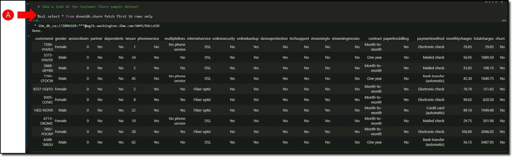

The goals of the Business Analyst are to derive helpful business insights from the available data. The business use case in this example is a Telco that is suffering too many customer cancelling their mobile and internet plans. The analyst wishes to discover patterns in the data that might provide insights as to what combinations of factors most frequently coincide with an account cancellation.

The Telco operational database is spread over tens of tables in a *third normal form* (1) data model. The Business Analyst needs to assess all the data fields that might be influential in the observed patterns of contract cancellation and bring them together in a Db2 table or view for SQL Data Insights to work on.
{ .annotate }

1.   Third normal form is a database schema design approach for relational databases which uses normalizing principles to reduce the duplication of data, avoid data anomalies, ensure referential integrity, and simplify data management. It was defined in 1971 by Edgar F. Codd, an English computer scientist who invented the relational model for database management. -<a href="https://en.wikipedia.org/wiki/Third_normal_form" target="_blank">Wikipedia</a>

The starting point for this process is that the Business Analyst has performed the review of relevant data, produced a table containing all the customers and the characteristics of their contracts with the company, and whether are still an active customer (**CHURN=No**) or not (**CHURN=Yes**).

!!! important "Scroll down in the Jupyter Notebook"

    Scroll down further through the Jupyter Notebook to view the data which the Business Analyst has opened. Use the ++ctrl+minus++ or ++ctrl+plus++ keys to adjust the view of the data.

- Run the cell that starts with **Take a look at the Customer Churn sample dataset** **(A)**.

    
    
Review the sample of data returned.