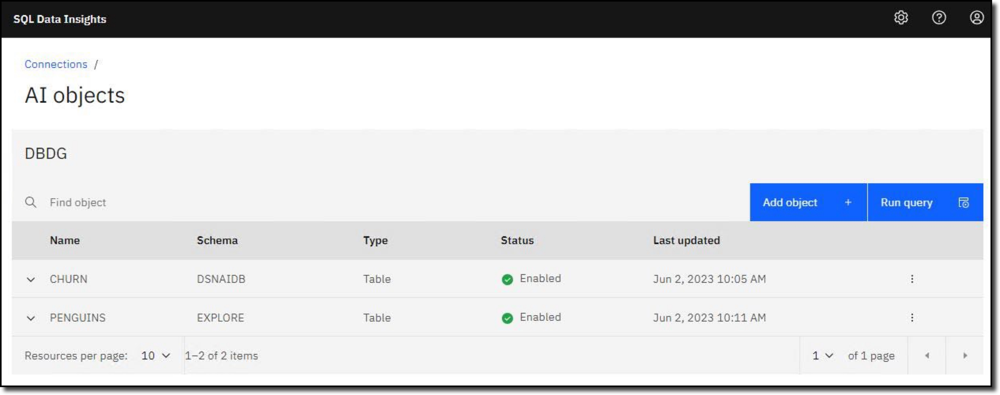

Follow the directions below to manage the SQL Data Insights service.

- In the virtual environment, open the **Google Chrome** **(A)** browser and enter the URL **B** for the SQL Data Insights web interface:

    ```
    https://wg31.washington.ibm.com:15001/
    ```
    
    

- If you see the message below click **Advanced** **(A)** and then clink on the **Proceed** link **(B)** to open the  unencrypted connection.

     

     

- Log into SQL Data Insights using user **(A)**:

      ```
      IBMUSER
      ```

      and password **(B)**:

      ```
      SYS1
      ```

      and then click **Sign in** **(C)**.

      

- SQL Data Insights has already been configured to access Db2 for z/OS. You will be connecting to a subsystem with **SSID=DBDG** and **LocationName=DALLASD**. Click the ellipses () at the right-hand side of the DBDG connection (A), and select Connect (B) from the dropdown menu.

     

- Use the same Resource Access Control Facility (RACF) credentials as before to connect to the DBDG subsystem. The user ID is **(A)**:
  
    ```IBMUSER```
    
     and password **(B)**:
     
     ```SYS1```
     
     and then click **Connect** button **(C)**.

     

In this demonstration you will be using 3 Db2 tables.

`DSNAIDB.CHURN`

:   A dataset from a telecommunications company (telco) containing 7,043 customer records, of which 1,869 have cancelled their contracts (Churn = Yes).

`EXPLORE.PENGUINS`

:   A classic data science dataset which is used as a sample dataset for learning data science. The challenge is to use several penguin measurements (weight, height, length, location, etc) to build a classification model to determine what species they are.

`EXPLORE.PENGUINS_UNC`

:   A view of the PENGUINS table that excludes the answer (the species).

!!! note "About the penguins dataset"

    The penguins dataset is well covered in a number of data science websites, including <a href="https://www.kaggle.com/code/parulpandey/penguin-dataset-the-new-iris" target="_blank">Palmer Archipelago (Antarctica) penguin data</a>.

- Display all the Db2 tables and views that have already been enabled for AI. Click the ellipses () **(A)** and then click **List AI objects** **(B)**.

    

The list of AI-enabled objects is displayed. This is the administration web page where you can work with AI-enabled objects and select new objects to train.



