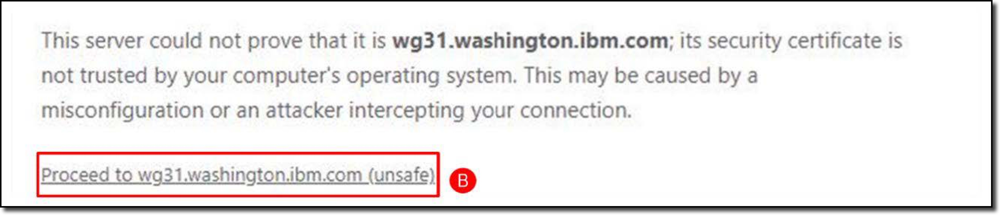
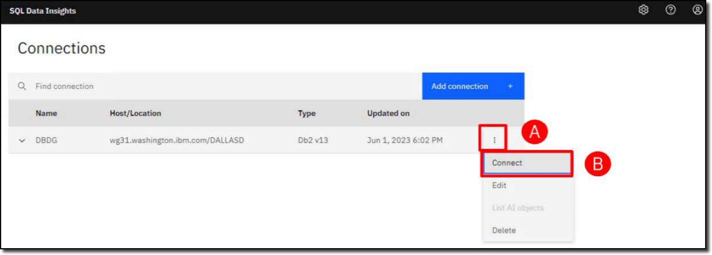
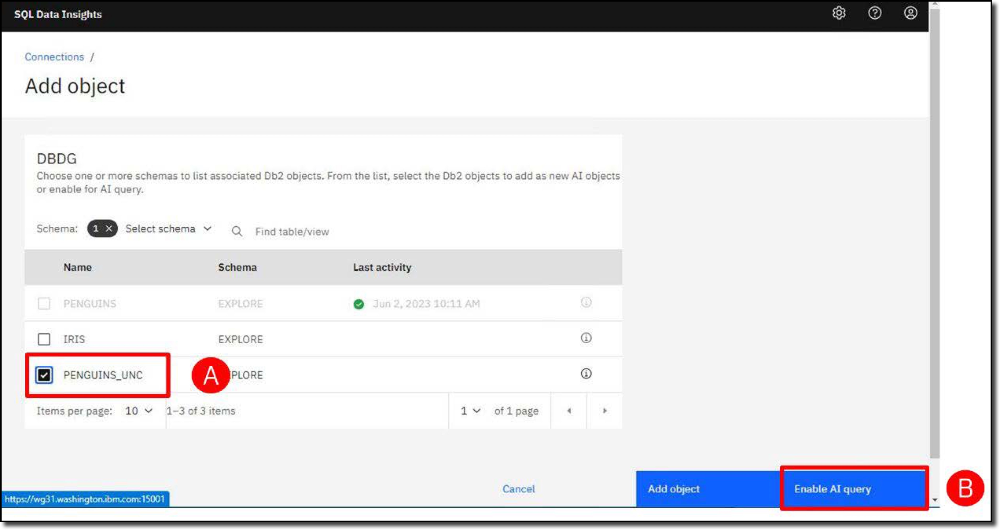
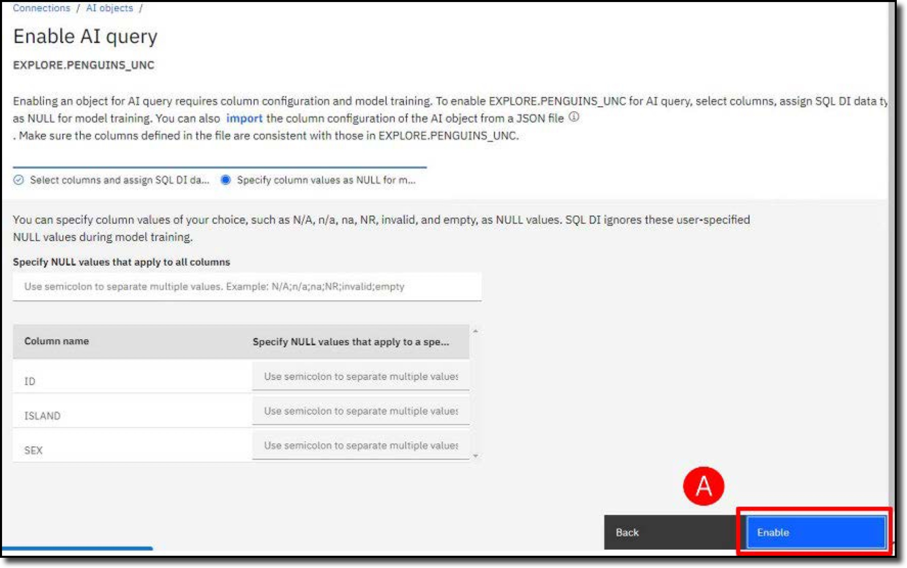
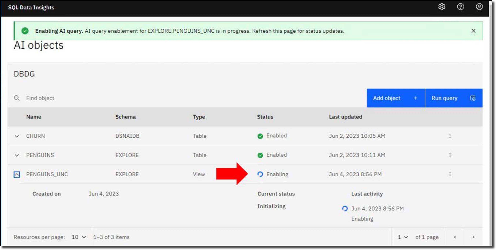
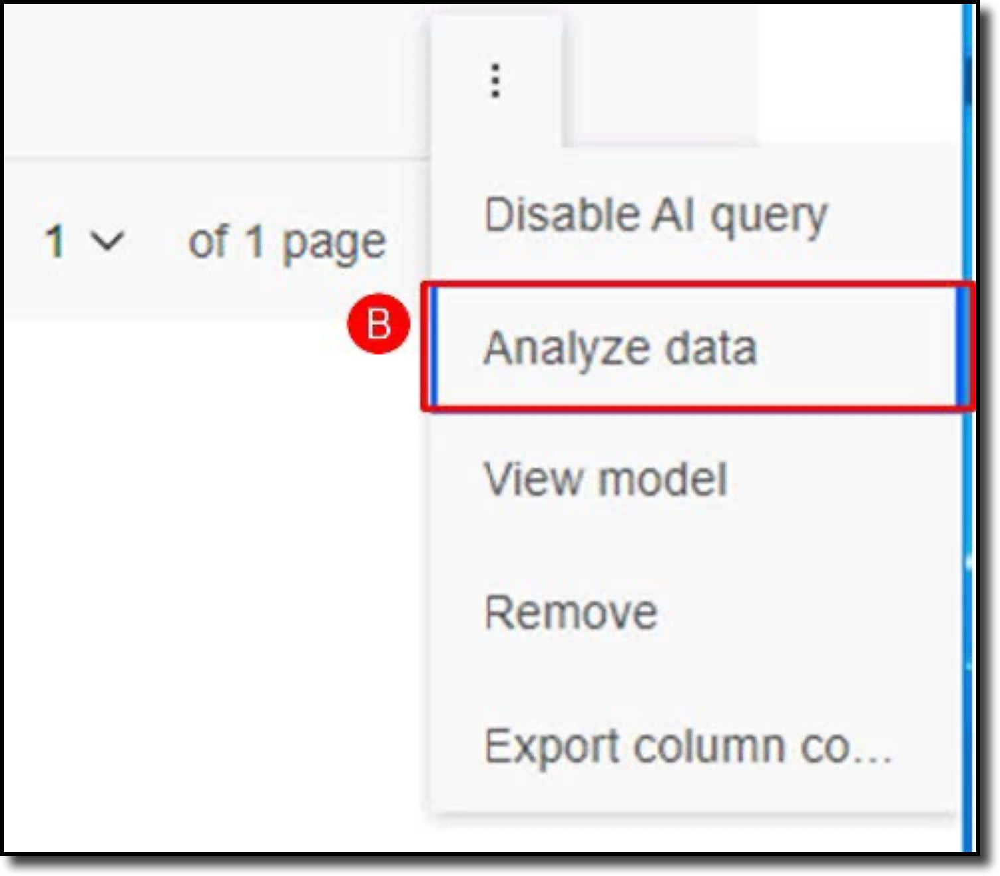
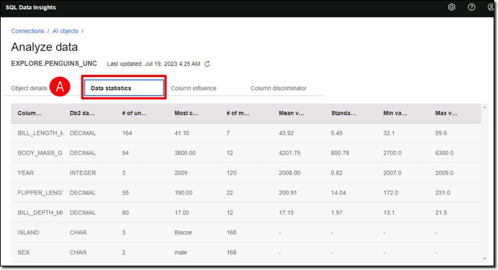
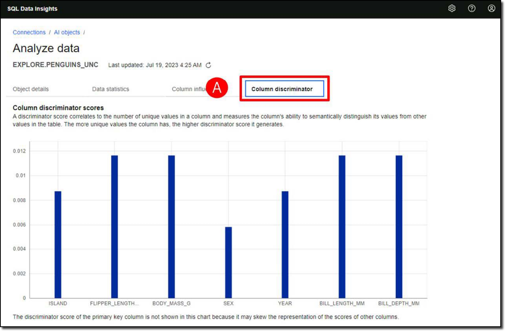

Follow the directions below to manage the SQL Data Insights service.

- In the virtual environment, open the **Google Chrome** **(A)** browser and enter the URL **(B)** for the SQL Data Insights web interface:

    ```
    https://wg31.washington.ibm.com:15001/
    ```
    
    

- If you see a "**Your connection is not private**" message, click **Advanced** **(A)** and then clink the **Proceed** link **(B)** to open the unencrypted connection.

     

     

- Log into SQL Data Insights using user **(A)**:

      ```
      IBMUSER
      ```

      and password **(B)**:

      ```
      SYS1
      ```

      and then click **Sign in** **(C)**.

      

- SQL Data Insights has already been configured to access Db2 for z/OS. You will be connecting to a subsystem with **SSID=DBDG** and **LocationName=DALLASD**. Click the ellipses () at the right-hand side of the DBDG connection **(A)**, and click Connect **(B)** from the dropdown menu.

     

- Use the same Resource Access Control Facility (RACF) credentials as before to connect to the DBDG subsystem. Enter the user ID **(A)**:
  
    ```
    IBMUSER
    ```
    
     and password **(B)**:
     
     ```
     SYS1
     ```
     
     and then click **Connect** **(C)**.

     

In this demonstration you will be using 3 Db2 tables.

`DSNAIDB.CHURN`

:   A dataset from a telecommunications company (telco) containing 7,043 customer records, of which 1,869 have cancelled their contracts (Churn = Yes).

`EXPLORE.PENGUINS`

:   A classic data science dataset which is used as a sample dataset for learning data science. The challenge is to use several penguin measurements (weight, height, length, location, etc) to build a classification model to determine what species they are.

`EXPLORE.PENGUINS_UNC`

:   A view of the PENGUINS table that excludes the answer (the species).

!!! info "About the penguins dataset"

    The penguins dataset is well covered in a number of data science websites, including <a href="https://www.kaggle.com/code/parulpandey/penguin-dataset-the-new-iris" target="_blank">Palmer Archipelago (Antarctica) penguin data</a>.

- Display all the Db2 tables and views that have already been enabled for AI. Click the ellipses () **(A)** and then click **List AI objects** **(B)**.

    

The list of AI-enabled objects is displayed. This is the administration web page where you can work with AI-enabled objects and select new objects to train.


- Click **Add object** **(A)** to invoke the dialog to train a new Db2 table or view.

    

- Select the **EXPLORE** schema to filter by **(B)** and click the magnifying glass icon () **(C)** to list the objects in that schema.

    

<div class="annotate" markdown>    
- From the generated list, select the **PENGUINS_UNC** table **(A)** (1) and then click **Enable AI query** **(B)**.
 
   

</div>

1.  This is a table with measurements of various penguins in a scientific study in Antarctica, without the species classification field (penguins unclassified). It would be cheating to include the classification field, because you want to assess how well SQL Data Insights can address the classification challenge without any formal data science expertise, and without using the answer.

- Review each of the fields in the table. First, checkmark all **column names** **(A)**. Next, you need to tell the SQL Data Insights model training process how to treat each field, according to the available data types: categorical, numerical, and key. Generally string data types should be treated as categorical fields, and numeric data types should be treated as numeric fields. Exception: numeric fields should be defined as categorial if they have a categorial meaning (for example phone numbers, postal codes, etc.), but this is not relevant for this demonstration. Change the **ID** field to the **Key** data type **(B)**. Click **Next** **(C)**.

    

- Optionally, you can tell SQL Data Insights what values to treat as NULL values and exclude from the model training process. The penguins’ data has very few null values, so you will skip this step and click **Enable** **(A)**.

    

The SQL Data Insights user interface will return to the **AI objects** panel. The **PENGUINS_UNC** table shows a status of **Training**.



SQL Data Insights is designed to be simple to use and there is tooling available to monitor its progress. The model training process uses an embedded Spark cluster to train the model. The Spark cluster provides a browser dashboard to monitor the status of Spark nodes, training jobs in progress, and completed training jobs. Training jobs are displayed with hyperlinks to access execution logs if needed.

- Open a new tab in the Google Chrome browser and enter the following URL **(A)** to open the **Spark dashboard**: 

    ```
    http://wg31.washington.ibm.com:8080
    ```

    

- Return to the SQL Data Insights tab and verify the table is now **Enabled**. You may need to refresh **(A)** the web page.

    

- Review the summary details of the trained models. Click the ellipses () next to the **PENGUINS_UNC** table **(A)** and click **Analyze data** **(B)**.

    
    

Click each of the four **tabs** to review the model details.

`Object details`

:   The **Object details** report **(A)** provides information about the features in the dataset.

    

`Data statistics`

:   The **Data statistics** report **(A)** is a collection of statistical analysis values of the data.

    

`Column influence`

:   The **Column influence** report **(A)** shows which features in the dataset were completed. Some of the penguins were not weighed or sexed.

    

`Colukmn discriminator`

:   The **Column discriminator** report **(A)** is derived from the neural network model that has been built and shows how significant the values of a column are in semantically distinguishing between different records.

    

