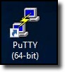
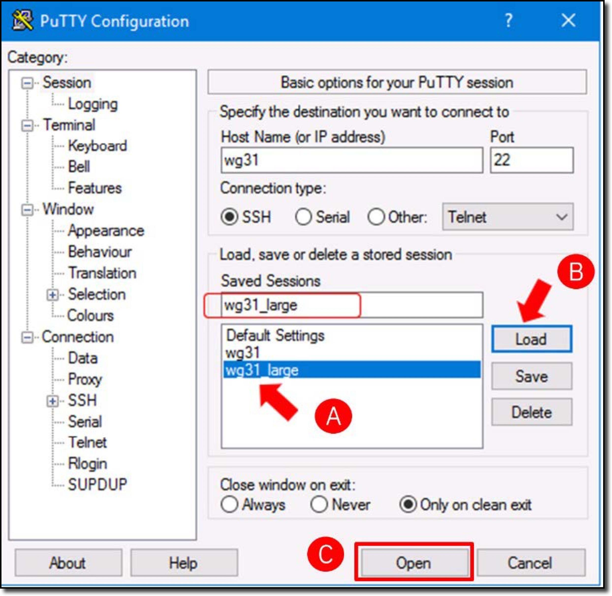
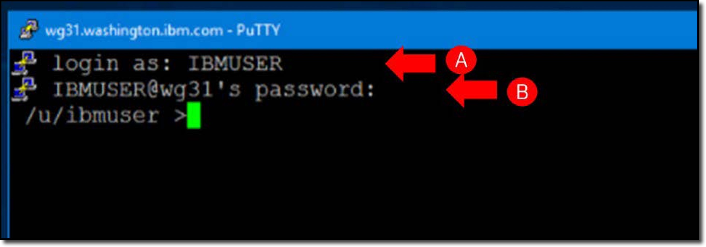

When instructions are given to type text, the text is usually like below:

```
Sample text to enter.
```

This is to help indicate that you need to type or copy/paste all of the text. Notice the **Copy to clipboard** button (). Use it to copy the text and then use your system's paste option (++cmd+v++ or ++ctrl+v++) to enter the text.

## Start the SQL Data Insights Service

- Open the **Putty terminal**, by clicking on the proper desktop icon **(A)**.

     

- Highlight the saved session called **wg31_large** **(A)**, and click **Load** **(B)**. Click **Open** **(C)** to open a ssh terminal session to the z/OS host: wg31.

    

- Login with user **(A)**:
  
    ```
    IBMUSER
    ```
    and password **(B)**:

    ```
    SYS1
    ```

    

- Switch user to **AIDBADM** (1) using the **su** command **(A)**: 
{ .annotate }
1. :**AIDBADM** is the instance owner of the SQL Data Insights instance.

     ```
     su - adibadm
     ```

     and enter the password **(B)**:

     ```
     AIDBADM
     ```

     

- Stat the SQL Data Insights instance using the command below **(A)**:
     
    ```
    sqldi.sh start
    ```

    

    The SQL Data Insights Services runs under Unix System Services (USS), which is why you have started it from the USS command line. It can easily be wrapped in a JCL member and run as a started task with system automation.
