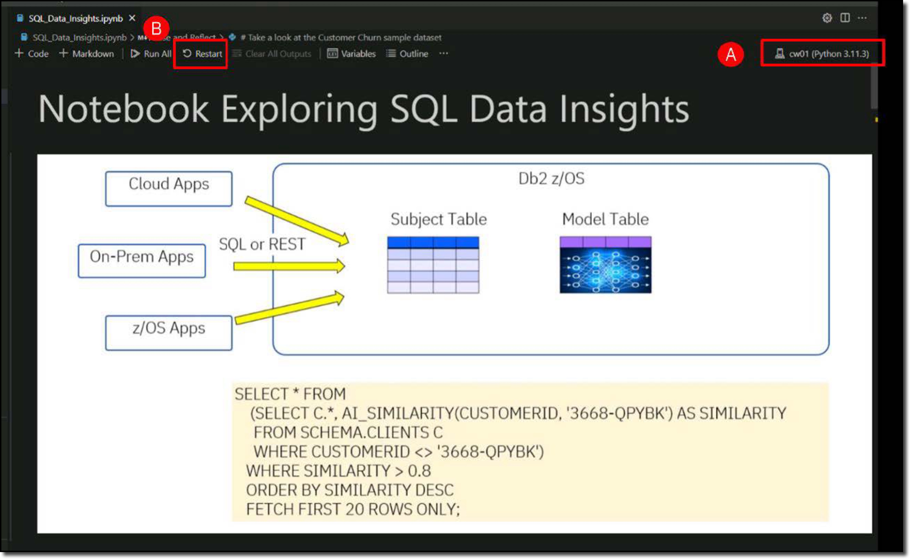
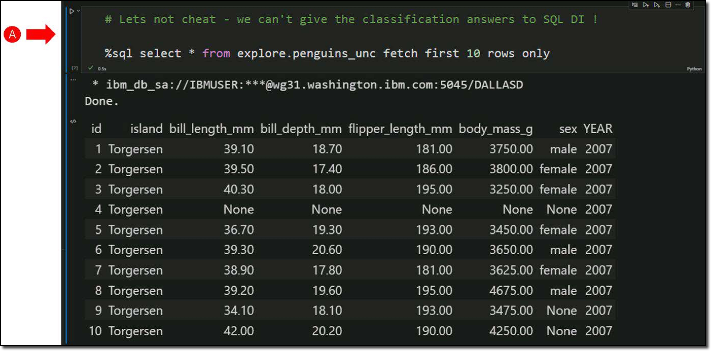
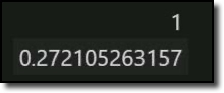
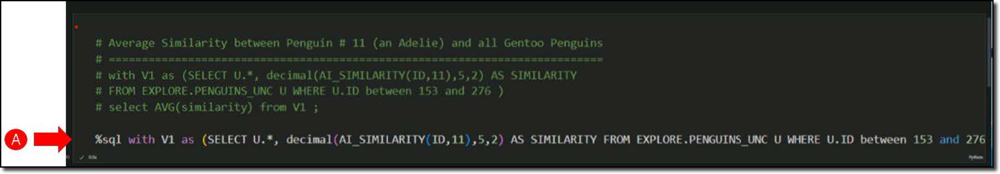
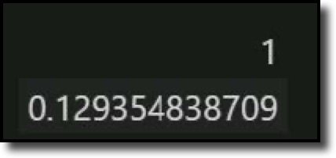

You can use any SQL client tool you like to write SQL queries that use SQL Data Insights. For example, when using a 3270 emulator you could use SQL Processor Using File Input (SPUFI) (1) or Query Management Facility (QMF) (2). Alternatively, from a Windows client you could use a developer Integrated Development Environment (IDE), or an analytics tool like QMF workstation.
{ .annotate }

1.   SPUFI is a database facility invented by IBM for interfacing with their Db2 system. It is accessed from within TSO ISPF from the DB2I Primary Option menu. SPUFI allows direct input of SQL commands in the TSO environment, rather than having them embedded within a program. Learn more about SPUFI <a href="https://en.wikipedia.org/wiki/IBM_Spufi" target="_blank">here</a>.
2.   QMF is a security-rich, simple-to-use business analytics and visualization tool optimized for IBM Z® data sources. Learn more about QMF <a href="https://www.ibm.com/products/db2-qmf" target="_blank">here</a>.

Since you are exploiting AI capabilities, it seems appropriate to use tools that are commonly used by data scientists. After all, one of the use cases for SQL Data Insights is to aid the data scientist perform data analysis (or data wrangling).

The Windows image of this demonstration has been pre-installed with Anaconda, Python, Jupyter Notebooks, and several data science libraries. You will invoke Jupyter Notebooks from Microsoft Visual Studio (VS) Code, to build your SQL queries.

- Click the **Visual Studio Code** desktop icon **(A)** to open VS Code.

    

- Open the **Notebook** named **SQL_Data_Insights.ipynb** if not already open. Click **File** **(A)**, then click **Open File** **(B)**, then click **SQL_Data_Insights.ipynb** **(C)**, and then click **Open** **(D)**.

    

Once the Notebook renders in VS, you may want to adjust the settings as follows.

- Use ++ctrl+minus++ or ++ctrl+plus++ to adjust the font size of all panels in the display.

<div class="annotate" markdown>
- Verify the Python kernel **cw01** loaded **(A)** (1). If needed (or if prompted), click **Restart** **(B)** to restart the kernel (2).

    

</div>
1.   This demonstration environment has no internet connectivity, and the cw01 kernel has all the libraries needed for this demonstration. They were previously installed so that you can run the notebooks.
2.   To start the notebook from scratch click **Restart** again to clear all outputs.

Next, run each step of the Jupyter notebook to connect to the data base and execute SQL statements.

!!! tip "To run a Jupyter notebook step"

    To run the instructions in a cell, you highlight the cell (a blue line will appear to the left of the cell) and click the **arrow** **(A)** to invoke the code in that cell or use the keyboard shortcut: ++ctrl+alt+enter++.

    

The notebook advises to train the model, but this has already been done. You don’t need to perform this step again. 

The first cell does not need to be run because the libraries were installed before the system was disconnected to the internet. If you execute this cell, it should tell you that all libraries were already satisfied. These are the libraries used: Python, "connect to Db2", and "format SQL results sets from Db2 nicely".

- Run the two cells used to import environment variables and libraries into the Python environment **(A)**.

    

<div class="annotate" markdown>
- Run the next two cells to load the SQL extension (from the sqlalchemy package) **(A)** and to establish a JDBC type 4 connection to Db2 on z/OS **(B)** (1).

    
</div>
1. The Db2 subsystem being used is a location name of **DALLASD** running on wg31.washington.ibm.com on port 5045. You are connecting with user ID **IBMUSER** and password **SYS1**.

Now you are ready to run SQL queries against the Db2 instance. Start with a simple SQL Select against the **EXPLORE.PENGUINS** table.

- Run the cell with the **SQL select** command **(A)**.

    

The Penguin dataset represents a data science classification challenge. Based on several observations, is it possible to accurately predict what species any penguin is? The output shown above contains the answer.

To validate the ability of SQL Data Insights to find similarities and differences between records, you need to create a view that excludes the answers. Thus, why the **EXPLORE.PENGUINS_UNC** view was created and trained in the previous steps.

- Run the **SQL select** against the **explore.penguins_unc** view **(A)**.

    

Now, perform an SQL query to test that one of the SQL Data Insights built in functions can be invoked successfully against the **PENGUINS_UNC** table that has an associated trained model.

- Run the **AI_SIMILARITY SQL select** against the **explore.penguins_unc** view **(A)**.

    

!!! important "Review the results!"

    The SQL query uses the **AI_SIMILARITY** function to measure the similarity of Penguin #11 to all other penguins in the dataset. At this point you are not trying to assess the accuracy of the SQL Data Insights model; rather, you are merely verifying that the model table has been trained and can be utilized by the SQL Data Insights built in SQL functions.

    The result set returns all the columns from the **PENGUINS_UNC** table, plus an additional column (**similarity**) which is the similarity of each penguin with Penguin #11.

    Note that this similarity score is not an absolute score or probability. It is a determination of the similarity of two records based on the unsupervised Deep Learning model that was trained by SQL Data Insights. When you write SQL queries you need to develop a feel for what that means in practical terms by designing your AI-enabled queries accordingly.

It would be good to perform some sort of accuracy check to check whether SQL Data Insights has done a good job of discovering the patterns in the penguin data measurements. You have the means to do that because you have the original dataset that included the species as determined by the Antarctic scientists who took all the measurements of the penguins in the first place.

Penguin #11 was determined to be an Adelie Penguin.

- Penguins with IDs from 1 to 152 are Adelie Penguins.
- Penguins with IDs from 153 to 276 are Gentoo Penguins.
- Penguins with IDs from 277 to 344 are Chinstrap Penguins.

You can write SQL queries to select:
- the average similarity of Penguin #11 to all other Adelie penguins
- the average similarity of Penguin #11 to all Gentoo penguins
- the average similarity of Penguin #11 to all Chinstrap penguins

<div class="annotate" markdown>
- Run the **SQL query** to select the **average similarity** of Penguin #11 to all other Adelie penguins **(A)** (1).

    

    The result (which may vary slightly when you train the model) shows a value *like* this:

    

</div>
1. SQL query
   ```%sql with V1 as (SELECT U.*, decimal(AI_SIMILARITY(ID,11),5,2) AS SIMILARITY FROM EXPLORE.PENGUINS_UNC U WHERE U.ID between 1 and 152 ) select AVG(similarity) from V1 ;```

<div class="annotate" markdown>
- Run the **SQL query** to select the **average similarity** of Penguin #11 to all all Gentoo penguins **(A)** (1).

    

    The result shows a value *like* this:

    

</div>
1. SQL query
   ```.sql %sql with V1 as (SELECT U.*, decimal(AI_SIMILARITY(ID,11),5,2) AS SIMILARITY FROM EXPLORE.PENGUINS_UNC U WHERE U.ID between 153 and 276 ) select AVG(similarity) from V1 ;```

<div class="annotate" markdown>
- Run the **SQL query** to select the **average similarity** of Penguin #11 to all all Chinstrap penguins **(A)** (1).

    

    The result shows a value *like* this:

    

</div>
1. SQL query
   ```.sql %sql with V1 as (SELECT U.*, decimal(AI_SIMILARITY(ID,11),5,2) AS SIMILARITY FROM EXPLORE.PENGUINS_UNC U WHERE U.ID between 277 and 344 ) select AVG(similarity) from V1 ;```

The first query shows a similarity much higher than the others two queries. There are some additional queries that you can run in the Jupyter notebook for additional information and testing.

Pause and reflect on what SQL Data Insights has just done. With absolutely zero data science skills and zero knowledge of the anatomy of penguins, SQL Data Insights can clearly differentiate between the species of penguin. It does this purely based on values, with no contextual reference frame in a Db2 table.

If SQL Data Insights can classify records from a classical data science dataset, then it can do the same for business-oriented datasets!