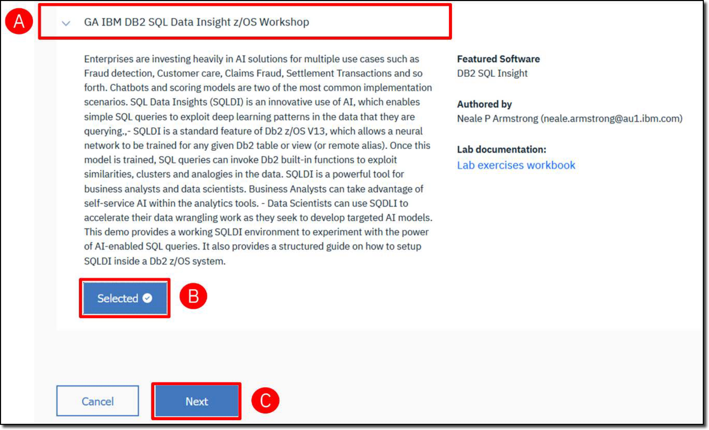

Before you start, reserve the demo environment using this <a href="https://zva.wdc1a.cirrus.ibm.com/" target="_blank">link</a>. Demo reservations should be submitted 2 days in advance. The reservation is accessible for up to 4 days.

- For IBMers: 
  
    Log in with your w3ID and VPN if working remotely to access and select **Request virtual access**. Expand and select the **GA IBM DB2 SQL Data Insight z/OS Workshop** **(A)** and click **Select** **(B)**. Then click **Next** **(C)** and complete the form to request demo access.

    

    You will receive an email when your demo environment is ready with access credentials.

- For Business Partners:
  
    Contact your IBM Business Partner Representative for environment access.

