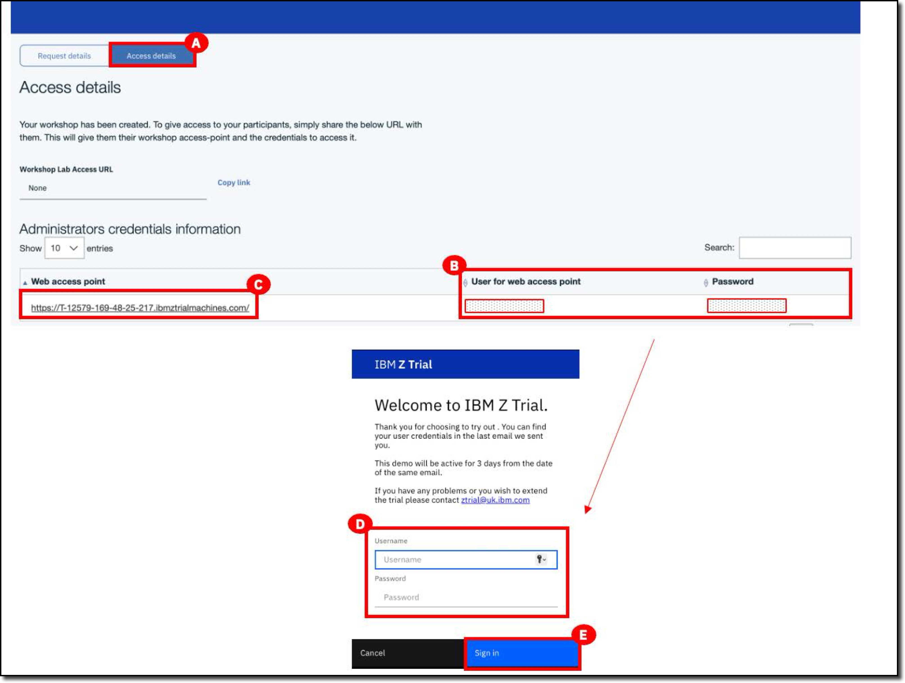

Follow these steps to when your reservation is ready.

- When your IBM Z Virtual Access (zVA) reservation is ready you will receive an email from IBM Z Trail (ztrail@uk.ibm.com) **(A)** with a link to sign in to IBM Z Virtual Access. In the e-mail, click the **IBM Z Virtual Access** **(B)** hyperlink.

    

- Select the **Access details** tab **(A)**. Take note of the **User for web access point** and **Password** provided on this tab **(B)**. Then click the link on the **Web access point** box **(C)**. The **IBM Z Trail** login window opens. Enter the **User for web access point** and **Password** (from the previous screen) into the **Username** and **Password** fields **(D)** and click **Sign in** **(E)**.

    

